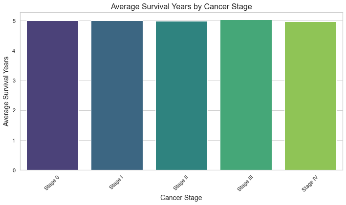

# phase3project

# 🎥Predictive Modeling and Risk Analysis of Cancer Severity and Survival Outcomes Using Machine Learning

## 🔍 Business Understanding

Cancer remains one of the leading causes of death globally, with its complexity and variability making treatment and prediction challenging. Health institutions are increasingly relying on data-driven approaches to improve patient outcomes. Accurate prediction of patient severity and survival likelihood can help healthcare providers prioritize care, allocate resources more effectively, and tailor treatment plans for better patient outcomes. The key goal is to explore and predict patient health outcomes based on demographic, lifestyle, and clinical variables using both statistical and machine learning techniques.

This project aims to analyze and model cancer patient data to:

1. To compute and visualize the correlation between the Target Severity Score and continuous risk factors.

2. To investigate whether survival outcomes differ significantly across various cancer stages.

3. To predict whether a patient has a high severity score.

4. To predict whether a patient will survive more than 5 years after diagnosis.

## 🧠 Data Understanding

The dataset titled Global Cancer Patients 2015–2024 is a synthetic representation of cancer patient records from multiple countries. Each record includes personal demographics, environmental and lifestyle risk factors, treatment costs, cancer type and stage, survival duration, and a calculated severity score. Although synthetic, the dataset is designed to mimic real-world patterns and can be used for educational, analytical, and modeling purposes.

## 🔍 Methodology:

1. **Data Cleaning and Preparation**:

 The dataset was initially loaded and assessed for duplicates, missing values, and outliers, particularly in the Target_Severity_Score column. To facilitate analysis, a new column, Severity_Score_Level, was created by categorizing the continuous severity score into two groups—High and Low—using 0 as the threshold. This categorization enabled a clearer interpretation of severity. The Severity_Target column was then introduced to convert the severity levels into a binary format appropriate for classification tasks. In a similar manner, survival years were categorized into a new column, Survival_Score_Level, distinguishing patients who survived more than 5 years from those who survived 5 years or less. The corresponding binary classification target, Survived_Target, was also created to support survival prediction modeling.

2. **Data Visualization**:
   
 Visualized the distribution of survival years across cancer stages, severity levels, and correlations between features. This helped TO understand the dataset better and identify key factors influencing cancer severity.

3. **Hypothesis Testing**

 Tested the hypothesis that cancer stage significantly impacts survival years. The results indicated no significant differences in survival years across cancer stages, suggesting uniformity in outcomes.

4. **Machine Learning Modeling**

Trained various machine learning models, including logistic regression, decision trees, and random forests, to predict survival and severity outcomes. The models were evaluated using accuracy, precision, recall, and F1-score.

5. **Model Performance**

 The logistic regression model emerged as the best-performing model, followed closely by the tuned random forest classifier and tuned decision tree when predicting the severity. The models generally performed well, with recall being a key metric due to the medical context of the dataset.The models used to predict the survival outcomes did not perform as good.

6. **Limitations**

Acknowledges areas where further exploration, data collection, or improved methods could enhance the results.

## 📊 Key Visualizations

1️⃣ Understanding the Top 10 Factors that are  Correlated with Target Severity Score

2️⃣ Understanding the distribution of Survival Years for Patients Surviving More than 5 Years

3️⃣Top 10 Features Influencing High Severity Prediction

4️⃣ROC Curve for Severity_Target Classifiers

**Conclusions**

This study explored cancer severity and 5-year survival prediction using machine learning models, including logistic regression, decision trees, and random forests. While the models achieved strong performance in predicting severity—especially after hyperparameter tuning, with logistic regression performing best—they showed limited accuracy in forecasting long-term survival, likely due to missing key clinical variables. Visualizations offered valuable insights into feature correlations, severity distributions, and survival patterns, while hypothesis testing revealed no significant survival differences across cancer stages. The analysis also emphasized the influence of factors like genetic risk, air pollution, alcohol use, smoking, and obesity on severity outcomes, highlighting the need for deeper research into lifestyle and genetic drivers of cancer prognosis.

**💻 Technologies Used**

Python - Pandas, Matplotlib, Seaborn, NumPy ,sklearn and scipy

Jupyter Notebook

**📂 Repository Structure**

scripts/ → Folder containing Script to automatically drop columns

Data/ → global_cancer_patient 2015-2024 

images/ → Folder containing images used throughout the notebook and README.md file

README.md → This project overview file

index.ipynb → The technical presentation

presentation.pdf → The non technical presentation